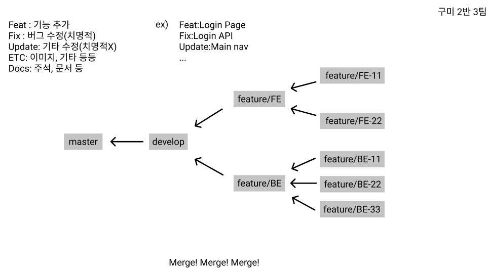

# SSAFY PJT2

## Domain : 빅데이터(추천)

### 구미 2반 3팀(D203)

> 이원우 `Frontend`
>
> 박다영 `Frontend`
>
> 최영수 `Backend`
>
> 김희석 `Backend`
>
> 김민경 `Backend`

2021년 8월 30일 ~ 2021년 10월 8일

> SUB 1 : 0830~0903
>
> SUB 2 : 0906~0917
>
> SUB 3 : 0920~1008

`commit message`

> feat - 새로운 기능 추가
>
> fix - 치명적인 버그 수정
>
> update - 치명적이지는 않은 것들 수정
>
> ETC - 이미지, 기타 등등
>
> Docs - 주석, 문서 등

`branch`

> feature/FE-[branch-name] => feature/FE
>
> feature/BE-[branch-name] => feature/BE
>
> [feature/FE, feature/BE] => develop

