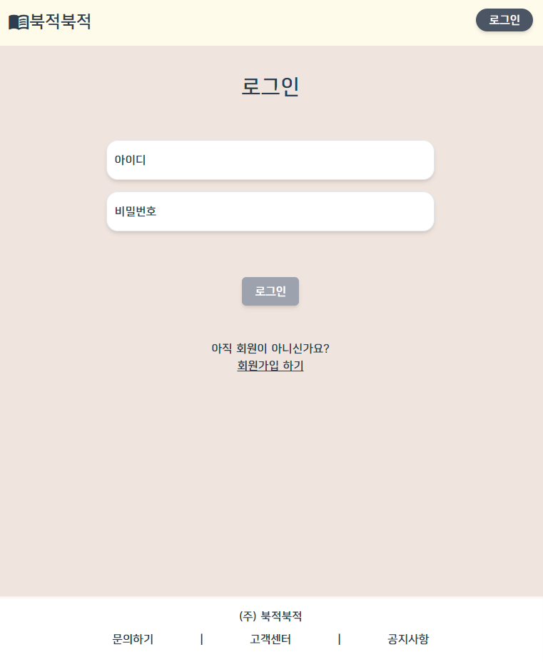
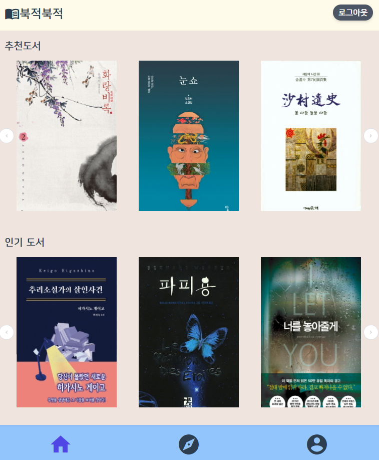
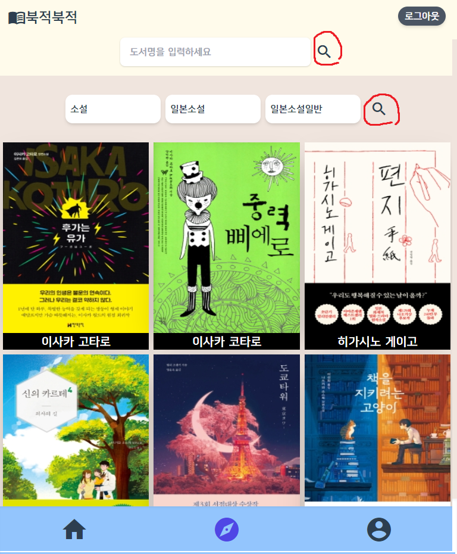
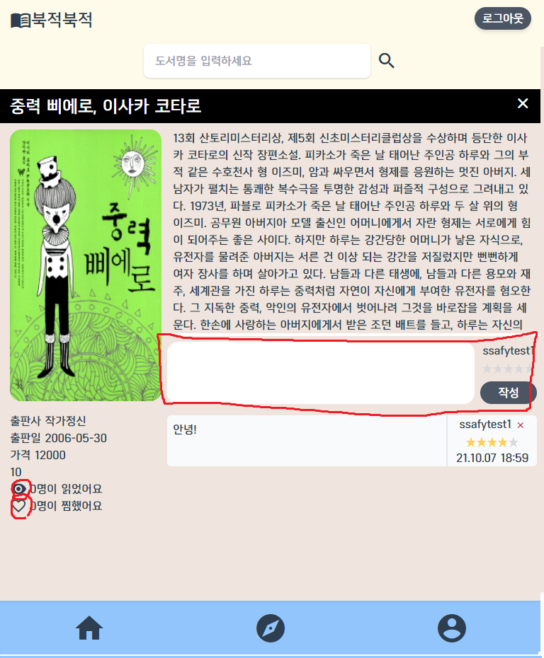
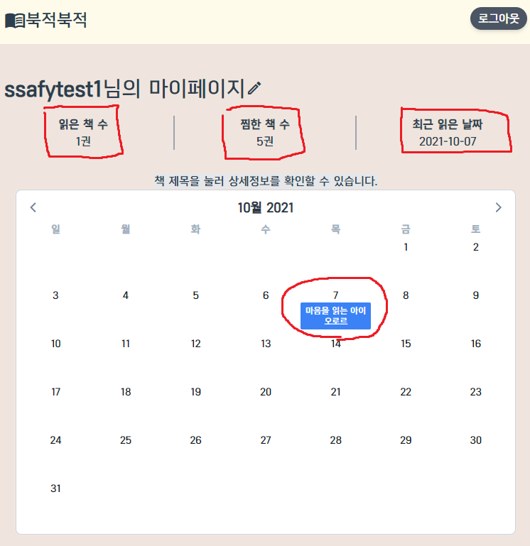
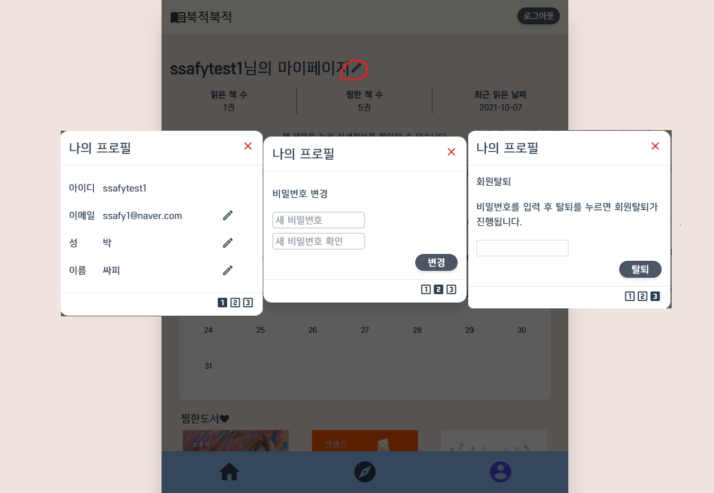

- ### 홈화면에서 회원가입을 눌러 회원가입을 진행합니다.

- ### 로그인 화면으로 가서 로그인과 회원가입을 진행할 수도 있습니다.

----------------

- ### 유효성 검사를 통과 후 회원가입 버튼 클릭

------------

- ### 회원가입과 동시에 다섯 개 이상의 책을 찜한 후 다음을 누른다(찜 목록 등록)

------------

- ### 찜한 책과 관려하여 유사도가 높은 책들이 자동으로 추천됩니다.

------------

- ### 아래의 나침반 아이콘을 클릭하여 검색 화면으로 이동, 카테고리를 선택 해 책을 검색할 수 있습니다.

- ### 위의 검색창을 이용하여, 제목이나 내용으로 검색할 수도 있습니다.

  

------------

- ### 책의 표지 이미지를 누르면 해당 책의 상세 페이지로 넘어가고 읽기, 찜하기, 리뷰 작성 및 삭제가 가능합니다.

  

------------

- ### 읽음 표시를 한 책은, 달력에 등록되고 읽은 책, 찜한 책, 마지막으로 읽은 날짜를 시각적으로 확인할 수 있습니다.

------------

- ### 연필버튼을 통해 내 정보 수정 및 회원 탈퇴 모달창으로 접근이 가능합니다.
  - #### 해당 이미지는 편의를 위해 모달창 3개를 한번에 표시했습니다.

------------

- ### 마이페이지의 아래쪽 화면에서는 내가 찜한 도서를 확인할 수 있고, 작성한 리뷰를 모아볼 수 있습니다.

